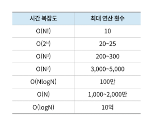

## 시간복잡도

### 시간복잡도란 알고리즘의 성능을 나타내는 지표로, 입력 크기에 대한 연산 횟수의 상한을 의미. 낮을수록 좋다.

### 빅오 표기법: 최악의 경우 시간 복잡도를 표현하는 점근적 표기법

### 최고차항만 남기고 차수를 지운다.

### 로그함수 < 다항함수 < 지수함수

### 빅오 표기법을 활용해 알고리즘의 시간복잡도를 파악하여 제한 시간내에 출력값이 나올 수 있을지 확인해볼 수 있다.

### 일반적으로 1초당 연산 횟수는 1000~3000만 정도로 고려해 시간 복잡도를 생각하자.

# Tip. 특정값을 계속 반으로 줄이는 동작을 한다면 시간 복잡도를 O(logN)이라 생각하자.
